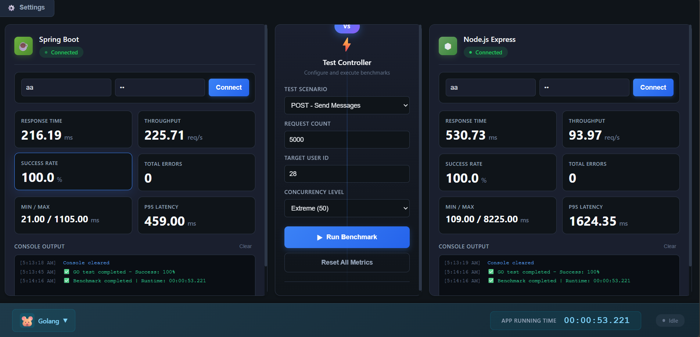
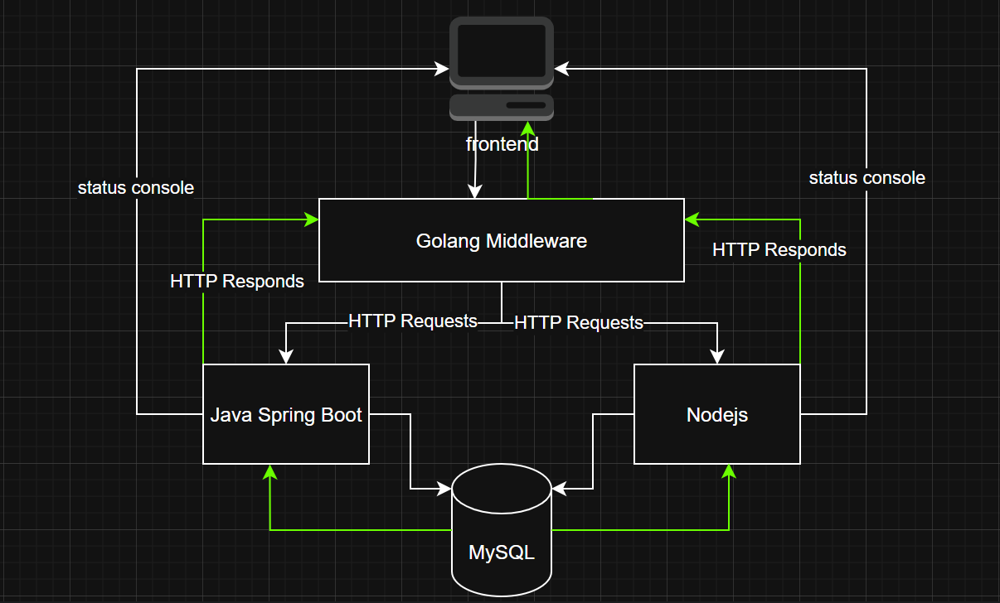

# 🚀 Spring Boot vs Node.js Messenger Benchmark

A performance testing platform that compares **Spring Boot vs Node.js** backends with real-time analytics andmetrics visualization.


## 📋 Overview

This project is a performance testing dashboard featuring for enterprise dual backend implementations repos with identical API contracts, enabling precise technology comparison real-time performance analytics through real-world messenger application testing.

## 📋 why this project

I found a gap in the backend when comparing real data with the many articles discussing non-real data. I needed answers about how far one technology is ahead of another in certain tests, and whether this difference is worth the disadvantages that come with that technology.
That’s why I decided to start this project.
 


## 🖼️ Dashboard Preview




## 🏗️ Architecture




```
Spring Boot vs Node.js Messenger Benchmark/
├── 🎨 frontend/                 # Performance Testing Dashboard (Port 3000)
├── ⚙️ middleware/go/           # Go Performance Engine (Port 8090)
├── ☕ backend/springboot/       # Spring Boot Backend (Port 8080 + 5001)
├── ⬢ backend/nodejs/           # Node.js Backend (Port 5000)
└── 🔨 build/                   # Build scripts
```

## 🚀 Quick Start

### Prerequisites
- **Java 17+** (Spring Boot)
- **Node.js 18+** (Node.js backend & frontend)
- **Go 1.21+** (Middleware)
- **MySQL 8.0+** (Database)

older versions not tested 100%

### 1. Clone & Setup
```bash
git clone https://github.com/dolamasa1/Spring-Boot-vs-Node.js-messenger.git
cd Spring-Boot-vs-Node.js-messenger

# Initialize submodules
git submodule update --init --recursive
```

### 2. Quick Database Setup
```sql
CREATE DATABASE messenger_db;
CREATE USER 'messenger_user'@'localhost' IDENTIFIED BY 'password';
GRANT ALL PRIVILEGES ON messenger_db.* TO 'messenger_user'@'localhost';
```

### 3. Start Backends
**Spring Boot (Port 8080):**
```bash
cd backend/springboot
mvn clean install
mvn spring-boot:run
```

**Node.js (Port 5000):**
```bash
cd backend/nodejs
npm install
npm start
```

### 4. Start Go Middleware (Port 8090)
```bash
cd middleware/go
go run *.go
 
## or

go run .
```

### 5. Frontend hosted via(Port 3000)
```bash
cd frontend
python -m http.server 3000
# or: npx http-server -p 3000
# or: php -S localhost:3000
```
the port matters because of the cors security configuration in the backends

### 6. Access Dashboard
Open `http://localhost:3000` in your browser.

## ⚡ Technology Stack

| Component | Technology | Purpose |
|-----------|------------|---------|
| **Frontend** | Vanilla JS + CSS3 | Performance dashboard with real-time animations |
| **Middleware** | Go 1.21+ | High-performance testing engine |
| **Backend A** | Spring Boot 3.2 + Java 17 | Enterprise Java implementation |
| **Backend B** | Node.js 18 + Express 4.x | JavaScript runtime implementation |
| **Database** | MySQL 8.0 | Data persistence for both backends |

## 🎯 Key Features

### 🔬 Performance Comparison
- **Dual Backend Testing**: Identical API contracts, different technologies
- **Real-time Metrics**: Live performance analytics with animated visualizations
- **Advanced Timing**: Separate HTTP time from language processing overhead
- **Statistical Analysis**: P95/P99 percentiles, throughput, success rates

### 🎨 Enhanced Dashboard
- **Animated Metrics**: Smooth counter animations and real-time updates
- **Responsive Design**: Mobile-first interface with dark theme
- **Progress Tracking**: Live progress bars with completion statistics
- **Console Output**: Color-coded logging with timestamps

### 🧪 Testing Scenarios
- **POST Tests**: Message creation and user registration
- **GET Tests**: User lists and message history
- **Mixed Loads**: Real-world request patterns
- **Stress Testing**: High-concurrency performance limits

needed to be increased more and more

### 💬 Messenger Features
- **Real-time Chat**: WebSocket messaging with user presence
- **Group Management**: Multi-user chat rooms
- **File Sharing**: Images, voice messages, documents
- **JWT Authentication**: Secure user management

## 🔌 API Endpoints (Both Backends)

### Core Endpoints
- `POST /api/auth/login` - JWT authentication
- `POST /api/auth/register` - User registration
- `GET /api/user/` - User search and lists
- `POST /api/message/send` - Send messages
- `POST /api/group/create` - Group management
- `GET /api/health` - System monitoring

### Real-time Features
- **Spring Boot**: Dual WebSocket (Spring + Socket.IO on port 5001)
- **Node.js**: Socket.IO real-time messaging
- **User Presence**: Online/offline status tracking

## ⚡ Performance Characteristics

### Spring Boot (Java)
- **✅ Strengths**: Better CPU performance, strong typing, enterprise features
- **❌ Weaknesses**: Higher memory usage, slower startup
- **🎯 Best For**: CPU-intensive operations, large teams

### Node.js Express
- **✅ Strengths**: Faster startup, better I/O, rapid development
- **❌ Weaknesses**: Single-threaded limitations, callback complexity
- **🎯 Best For**: I/O-intensive apps, real-time features

### Go Middleware
- **Exclusive Engine**: Replaced JavaScript middleware for superior performance
- **High Concurrency**: Goroutine-based request handling
- **Accurate Metrics**: Millisecond-precision timing with real values

## 🛠️ Configuration

### Spring Boot (`application.properties`)
```properties
spring.datasource.url=jdbc:mysql://localhost:3306/messenger_db
app.jwt.secret=your-jwt-secret
app.websocket.type=both
```

### Node.js (`.env`)
```env
DB_HOST=localhost
DB_NAME=messenger_db
JWT_SECRET_KEY=your-jwt-secret
PORT=5000
```

### Go Middleware
- **Port**: 8090 (fixed)
- **CORS**: Enabled for frontend integration
- **Concurrency**: Configurable worker pools

## 🧪 Testing Workflow

1. **Configure Settings**: Set backend endpoints and authentication
2. **Authenticate**: Connect to both backends using JWT tokens
3. **Select Scenario**: Choose test type and parameters
4. **Execute Tests**: Run via Go middleware with real-time monitoring
5. **Analyze Results**: Compare metrics with animated visualizations

## Anticipated Outcomes

 ### Typical Performance Patterns: **Spring Boot**: Better type safety and consistent performance under CPU load; **Node.js**:  Better I/O management and quicker response times for multiple requests at once- **Go Middleware**: 3-5 times more throughput than the outdated JavaScript version

 ### Metric Comparisons: **Response Times**: Actual millisecond measurements, not zeros; **Throughput**: Requests per second based on the actual test duration; **Success Rates**: Accuracy based on HTTP status codes; **Resource Usage**: Analysis of memory and CPU efficiency

 ## 🐛 Repairing

 ### Fast Verification ```bash # Verify every service curl http://localhost:8080/api/health #  http://localhost:5000/api/health # Spring Boot curl  Node.js curl http://localhost:8090/api/health #  Go Middleware

 # Verify ports using netstat -tulpn | grep -E ':(8080|5000|8090|3000)' ```
### Common Issues
- **CORS Errors**: Serve frontend via HTTP server, not file protocol
- **Database Connection**: Verify MySQL is running and credentials match
- **Authentication**: Check JWT tokens and backend connectivity
- **Port Conflicts**: Ensure ports 8080, 5000, 8090, 3000 are available

## 📚 Component Records

 [**Frontend Dashboard**] Real-time testing interface (./frontend/README.md)- [**Backend Comparison**] (./backend/README.md): Node.js vs. Spring Boot
 - [**Go Middleware**] (./middleware/go/README.md)  Engine for performance testing - [**Configuration**] (./config/README.md): Management of endpoints and settings

 ## 🔮 Roadmap

 ### Upcoming Version (v1.1)
 - [ ]  Advanced encryption for messages - [ ]  Integration of push notifications - [ ]  Variants of the microservices architecture - [ ]  Examples of Kubernetes deployments

 ### Research Extensions - [ ] Other backend technologies (.NET, Go, and Python)
 - [] Various database systems (MongoDB, PostgreSQL)
 - [ ]  sophisticated caching techniques (Redis)

 ## Participating

 Contributions are welcome!  For more information, please refer to our [Contributing Guide](CONTRIBUTING.md).

 ## 📄 Permit

 **MIT License** -  For complete information, see the [LICENSE](LICENSE) file.

 ## 👨‍💻 Writer

 **Ahmed Adel Moghraby** 📧 [ahmed.adel.elmoghraby@gmail.com] (email: Ahmed.adel.elmoghraby@gmail.com)  
 🌐 [GitHub: dolamasa1] (https://github.com/dolamasa1)

 ---

 **Designed for accurate performance analysis** * Comparable features, distinct technologies, and when and what to use..*
